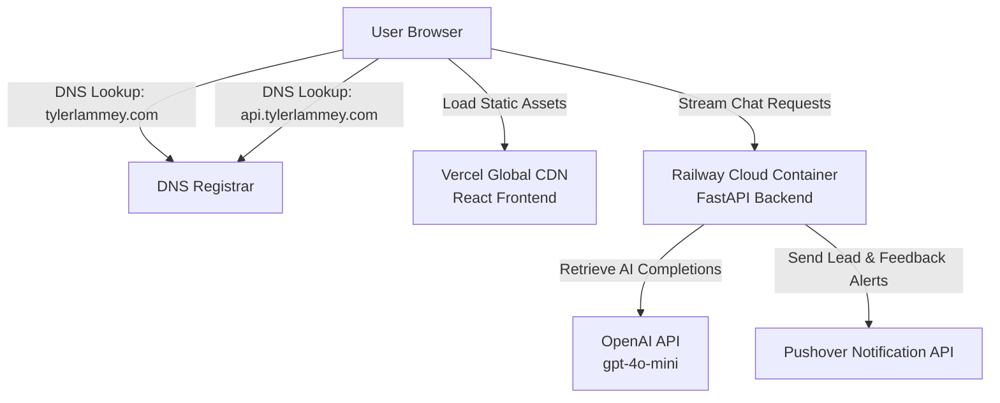

# Production Deployment Guide: tylerlammey.com

This guide details the production deployment architecture and step-by-step configuration for **tylerlammey.com**. 

The website uses a decoupled architecture with a static React frontend hosted on **Vercel** and a FastAPI backend running on **Railway**, unified under a custom domain name.

---

## 1. System Architecture

To optimize performance, scalability, and costs, the frontend and backend are hosted on separate, specialized platforms:



### Components
1. **Frontend (Vercel)**: Compiles the React (Vite) application and serves the static HTML/CSS/JS globally via an optimized Edge CDN.
2. **Backend (Railway)**: Runs the FastAPI server in a virtualized Docker container, handling real-time OpenAI streaming completions and logging.
3. **Integrations**:
   - **OpenAI API**: Powers the streaming chat engine (TylerGPT).
   - **Pushover API**: Sends real-time notifications when a user submits contact info or when TylerGPT cannot answer a query.

---

## 2. Infrastructure Setup & Deployment

### Step 1: Deploy the FastAPI Backend to Railway

Railway automatically detects Python code repositories, installs requirements, and exposes a containerized service.

1. Log into your [Railway Dashboard](https://railway.app).
2. Click **New Project** > **Deploy from GitHub repo** and select your repository.
3. Once the repository is imported, click on the backend service card to configure its settings:
   - **Root Directory**: `backend`
   - **Custom Start Command**: `uvicorn app:app --host 0.0.0.0 --port $PORT` (Railway provides the `$PORT` environment variable dynamically).
4. Navigate to the **Variables** tab and add the production credentials:
   - `OPENAI_API_KEY`: *[Your OpenAI API Key]*
   - `PUSHOVER_USER`: *[Your Pushover User Key]*
   - `PUSHOVER_TOKEN`: *[Your Pushover App/API Token]*
   - `ALLOWED_ORIGINS`: `https://tylerlammey.com,https://www.tylerlammey.com` (Secures your backend so only requests originating from your portfolio site are allowed).
5. Under **Settings** > **Domains**, Railway will provide a default domain (e.g., `https://backend-production.up.railway.app`). Keep this URL handy for the frontend step.

### Step 2: Deploy the React Frontend to Vercel

Vercel builds and hosts React apps out of the box with Git-based triggers.

1. Log into your [Vercel Dashboard](https://vercel.com).
2. Click **Add New** > **Project** and select your GitHub repository.
3. Configure the deployment settings:
   - **Framework Preset**: `Vite` (automatically detected)
   - **Root Directory**: `frontend`
4. Expand **Environment Variables** and add:
   - **Key**: `VITE_API_URL`
   - **Value**: `https://api.tylerlammey.com` (The subdomain where the backend will live, with *no* trailing slash).
5. Click **Deploy**. Vercel will compile the site and generate a temporary `.vercel.app` URL.

---

## 3. Custom Domain & DNS Settings

To map the custom domain `tylerlammey.com` and its subdomain `api.tylerlammey.com`, configure the records below in your domain registrar (e.g., Porkbun, Namecheap, Cloudflare).

### DNS Record Requirements

| Type | Host | Value / Target | Description |
| :--- | :--- | :--- | :--- |
| **A** | `@` | `76.76.21.21` | Points the base apex domain to Vercel's global IP |
| **CNAME** | `www` | `cname.vercel-dns.com` | Points the WWW subdomain to Vercel's Edge routing |
| **CNAME** | `api` | `[your-backend-id].up.railway.app` | Points the backend subdomain to your Railway container |

### Custom Domain Configuration

#### 1. In Vercel (Frontend)
1. Go to your Vercel project dashboard, then **Settings** > **Domains**.
2. Enter `tylerlammey.com` and click **Add**. Vercel will automatically configure redirects for `www.tylerlammey.com` to point to the apex domain.

#### 2. In Railway (Backend)
1. Go to your backend service dashboard in Railway, then **Settings** > **Domains**.
2. Click **Custom Domain** and enter `api.tylerlammey.com`.
3. Railway will generate the corresponding CNAME target you need to enter into your registrar's DNS settings.

---

## 4. Cost Breakdown & Budgeting

| Component | Host / Provider | Plan / Pricing | Monthly Cost |
| :--- | :--- | :--- | :--- |
| **Frontend** | Vercel | Hobby Tier | **$0** |
| **Backend** | Railway | Hobby / Developer Plan | **~$5.00** (or usage-based) |
| **SSL / HTTPS** | Let's Encrypt | Automatic via hosts | **$0** |
| **AI LLM Queries** | OpenAI API | Pay-as-you-go (`gpt-4o-mini`) | **~$1 - $3** (traffic dependent) |
| **Notifications** | Pushover API | One-time license per device | **$0** |

---

## 5. Security & Best Practices

1. **CORS Restrictions**:
   The backend restricts request headers using FastAPI's [CORSMiddleware](file:///c:/Users/tyler/Documents/Personal%20Website/backend/app.py#L217-L223). The baseline origins are defined directly in [allowed_origins](file:///c:/Users/tyler/Documents/Personal%20Website/backend/app.py#L205-L210), and can be dynamically expanded using the `ALLOWED_ORIGINS` variable.
2. **Protecting Secrets**:
   * Production API keys must **never** be committed to GitHub.
   * [backend/.gitignore](file:///c:/Users/tyler/Documents/Personal%20Website/backend/.gitignore) and [frontend/.gitignore](file:///c:/Users/tyler/Documents/Personal%20Website/frontend/.gitignore) are preconfigured to ignore `.env` files.
3. **OpenAI Budget Controls**:
   Ensure you set a **hard spending limit** (e.g., $5.00/month) in your OpenAI Developer Dashboard under Billing > Limits to prevent run-away costs from web scraping, spam, or high traffic.

---

## 6. Local Development Reference

To run the application locally for debugging or feature development:

### Backend Setup
```bash
cd backend
source .venv/bin/activate  # Windows: .venv\Scripts\activate
python app.py
```
*Server runs locally at `http://localhost:8000`.*

### Frontend Setup
```bash
cd frontend
npm run dev
```
*Server runs locally at `http://localhost:5173` (defaults to target `http://localhost:8000` when `VITE_API_URL` is undefined).*.
